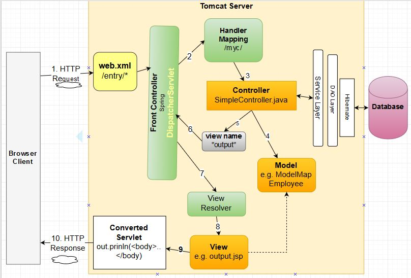

# Spring MVC

En este proyecto vamos a ver como podemos implementar una aplicacion completa con Spring MVC.

## Arquitectura

Spring MVC sigue el patron llamado FaceController, es decir, tendremos un Servlet que recibira todas las peticiones HTTP, y este servlet sera el encargado de llamar a las clases controladoras que se hayan dado de alta en el contexto de spring.

## Configuracion

Como primer paso debemos de crear un proyecto web y meter las dependecias que necesitaremos de Spring Context y Spring MVC. Se puede convertir luego el proyecto a maven para meter las librerías de forma simple.

El siguiente paso sería configurar el contexto de spring y nuestro FrontController para que Tomcat lo instancie al arrancar el servidor, para ello modificaremos el web.xml para dar del alta el servlet de spring.

Como tercer paso, configuramos nuestro fichero xml del contexto de Spring (applicationContext.xml) para dar de alta el resto de los beans que usaremos en nuestra aplicacion. Dicho fichero tiene que estar situado al mismo nivel que el web.xml

Una vez hecho esto ya podemos empezar a hacer la aplicacion y crear los controladores.

## Visualizacion del ejemplo

Entrando por index.html empezaremos viendo la parte del saludo y acabaremos viendo la parte de las personas.

## Bibliografia

- [https://spring.io/guides/gs/serving-web-content/](https://spring.io/guides/gs/serving-web-content/)